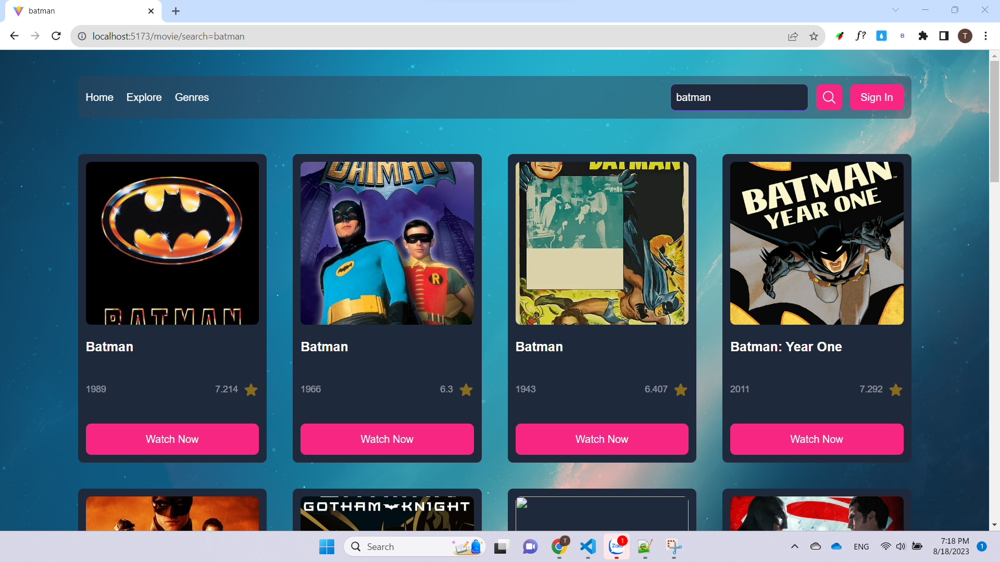
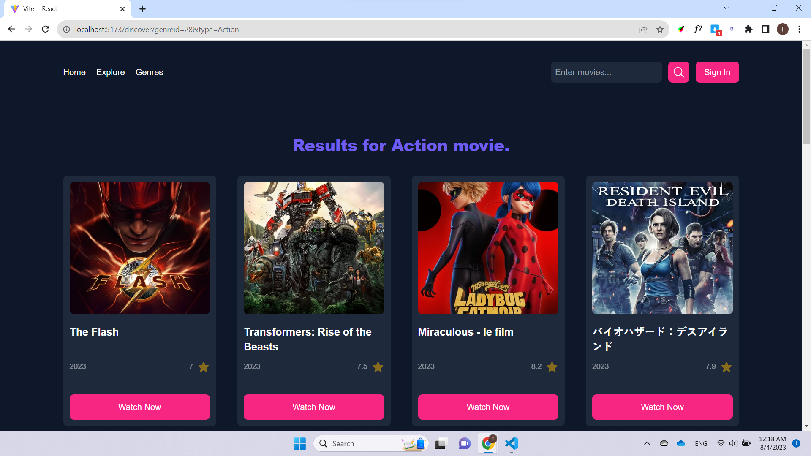

# Movie App - README

Welcome to Movie App! This is a web application built using React and powered by Vite. Movie App allows users to discover and explore various movies, view details, and search for their favorite films. The app utilizes the Movie Database (TMDB) API to fetch movie data and provide a seamless user experience.

## Table of Contents

-   [Introduction](#introduction)
-   [Page](#page)
-   [Features](#features)
-   [Getting Started](#getting-started)
-   [Usage](#usage)
-   [Search](#search)
-   [Movie Details](#movie-details)
-   [Contributing](#contributing)
-   [License](#license)

## Introduction

The Movies App is a platform that allows users to explore a vast collection of movies. The application leverages the power of React to deliver a seamless and responsive user experience. By utilizing Vite, the development process is streamlined, enabling faster loading times and better performance.

## Page

1. **Home page:** On this page, You will see the banner of currently showing movies at the theater, and below it is a list of trending, top-rated, and popular movies.
   

2. **Explore page:** On this page, You can find the latest lineup of movies currently playing at our theater.
   

3. **Movie details page:** On this page, You will find comprehensive information about the selected movie. This includes the movie's synopsis, cast, director, release date, genre, and user ratings.

    

## Features

The Movies App comes equipped with the following features:

1. **Now Playing:** View a curated list of movies currently being screened in theaters.

2. **Trending Movies:** Discover the latest trending movies that are gaining popularity.

3. **Top Rated Movies:** Explore a selection of movies with the highest user ratings.

4. **Popular Movies:** Browse a collection of the most popular movies.

5. **Movie Search:** Easily find movies by searching for their titles.

6. **Genre-based Search:** Filter movies based on specific genres.

7. **Movie Details:** Access detailed information about each movie, including synopsis, cast, release date, and more.

## Installation

To run Movie App on your local machine, follow these steps:

1. Ensure you have Node.js installed on your system.
2. Clone this repository: `git clone https://github.com/your-username/movie-app.git`.
3. Navigate to the project directory: `cd movie-app`.
4. Install dependencies: `npm install` or `yarn install`.
5. Start the development server: `npm run dev` or `yarn dev`.
6. Open your browser and go to `http://localhost:5173` to access the Movie App.

## Usage

Upon accessing the Movies App, you will be presented with the home page, featuring various movie categories. Clicking on each category will lead you to a list of relevant movies. From there, you can click on any movie to view its detailed information.

## Search

The Movies App offers two methods for searching movies:

Search by Title: Use the search bar at the top of the page to find movies by their titles.

Search by Genre: Use the genre filters to narrow down movies by specific categories.

## Movie Details

When viewing a movie's details, you will find comprehensive information about the selected movie. This includes the movie's synopsis, cast, director, release date, genre, and user ratings.

## Contributing

We welcome contributions from the community to enhance the Movies App further. If you find any issues or have ideas for improvements, feel free to open a GitHub issue or submit a pull request.

## License

The Movies App is licensed under the MIT License. Feel free to use, modify, and distribute the code as per the terms of this license.

##

#### Thank you for choosing the Movies App! We hope you enjoy exploring a world of movies with our application. If you have any questions or need assistance, please don't hesitate to reach out to us. Happy movie watching!🍿
