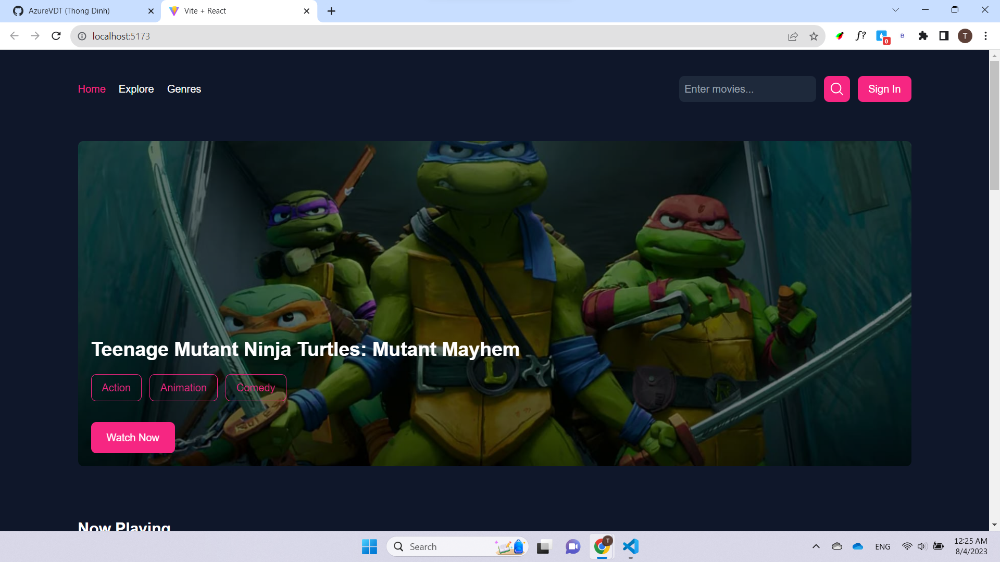
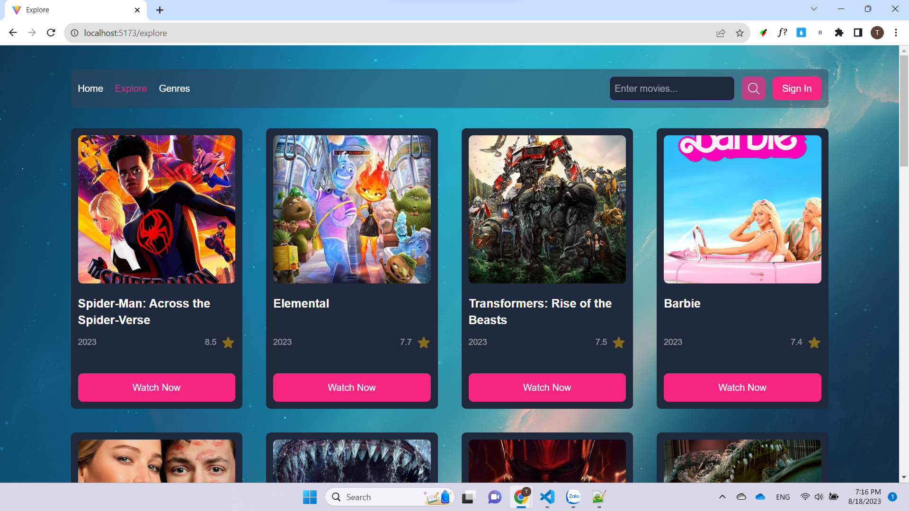
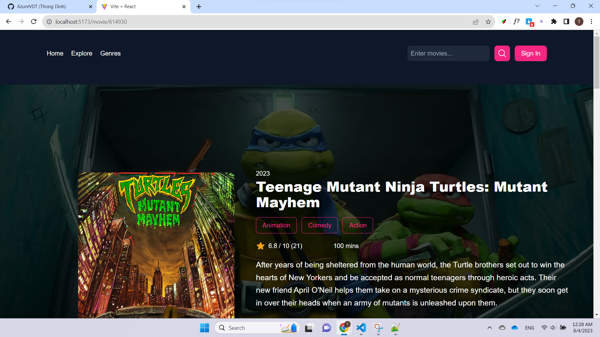
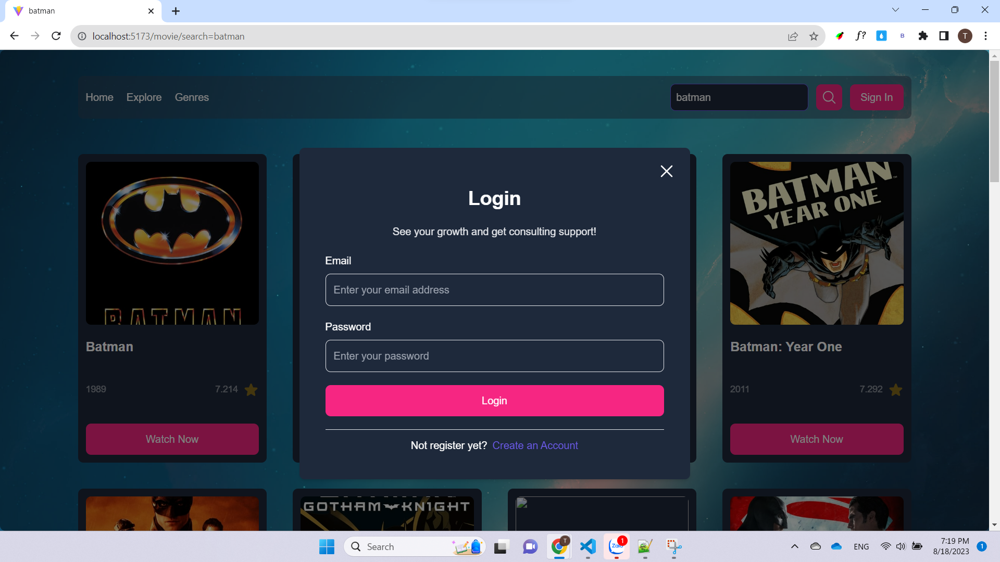
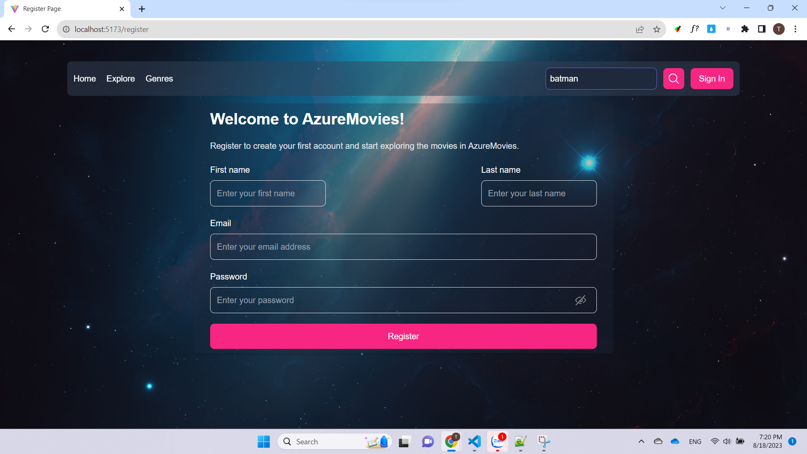
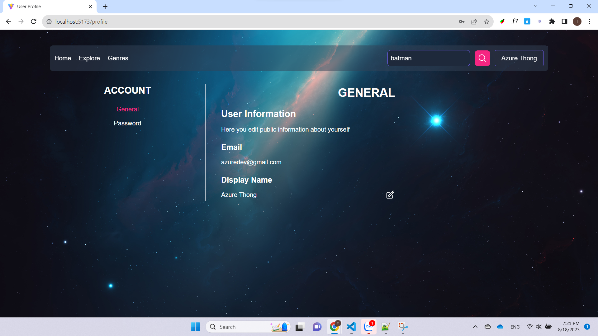
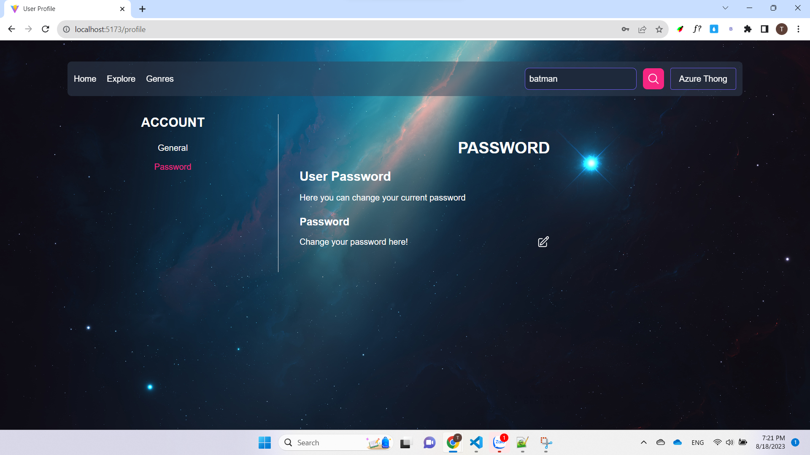

# Movie App - README

Welcome to Movie App! This is a web application built using React and powered by Vite. Movie App allows users to discover and explore various movies, view details, and search for their favorite films. The app utilizes the Movie Database (TMDB) API to fetch movie data and provide a seamless user experience.

## Table of Contents

-   [Introduction](#introduction)
-   [Pages](#pages)
-   [Features](#features)
-   [Getting Started](#getting-started)
-   [Usage](#usage)
-   [Search](#search)
-   [Movie Details](#movie-details)
-   [Login](#login)
-   [Register](#register)
-   [Change Password](#change-password)
-   [Change Display Name](#change-display-name)
-   [Contributing](#contributing)
-   [License](#license)

## Introduction

The Movies App is a platform that allows users to explore a vast collection of movies. The application leverages the power of React to deliver a seamless and responsive user experience. By utilizing Vite, the development process is streamlined, enabling faster loading times and better performance.

## Pages

1. **Home page:** On this page, You will see the banner of currently showing movies at the theater, and below it is a list of trending, top-rated, and popular movies.
   

2. **Explore page:** On this page, You can find the latest lineup of movies currently playing at our theater.
   

3. **Movie details page:** On this page, You will find comprehensive information about the selected movie. This includes the movie's synopsis, cast, director, release date, genre, and user ratings.

    

4. **Login page:** On this page, registered users can log in to access app features.

    

5. **Register page:** On this page, new users can create an account.

    

6. **User profile page:** On this page, logged in users can change their display name, password, and access account settings.

    - **Change display name:** Click the edit icon and enter a new display name, then click Finish to save changes.

        

    - **Change password:** Click the edit icon and enter current and new password, then click Finish to save changes.

        

## Features

The Movies App comes equipped with the following features:

1. **Now Playing:** View movies currently screening in theaters.

2. **Trending Movies:** Discover trending and popular movies.

3. **Top Rated Movies:** Highly rated movies by users.

4. **Movie Search:** Search movies by title.

5. **Genre Search:** Find movies by genre.

6. **Movie Details:** View synopsis, cast, release date etc.

7. **User Login:** Registered users can log in.

8. **User Registration:** New users can create an account.

9. **Change Display Name:** Edit account display name.

10. **Change Password:** Change account password.

11. **Account Settings:** Manage user account.

## Installation

Follow these steps to run the app locally:

1. Clone the repo `git clone https://github.com/your-username/movie-app.git`
2. Install dependencies with `npm install`
3. Start development server with `npm run dev`
4. Go to `http://localhost:5173` in your browser.

## Usage

On the homepage, browse movie categories or use search to find movies. Click a movie to see details. Registered users can log in to access account features.

## Search

-   **Search by title:** Use search bar to find movies by title.

-   **Search by genre:** Use genre filters to find movies.

## Movie Details

Movie details include synopsis, cast, director, release date, genre and ratings.

## Login

Registered users can log in with their credentials on the login page. This provides access to account features.

## Register

New users can create an account by providing details on the register page.

## Change Password

Logged in users can change their account password on the profile page.

## Change Display Name

Logged in users can edit their display name on the profile page.

## Contributing

Contributions are welcome! Please open issues or submit pull requests.

## License

This project is under the MIT License.

##

#### Thank you for choosing the Movies App! We hope you enjoy exploring a world of movies with our application. If you have any questions or need assistance, please don't hesitate to reach out to us. Happy movie watching!🍿
